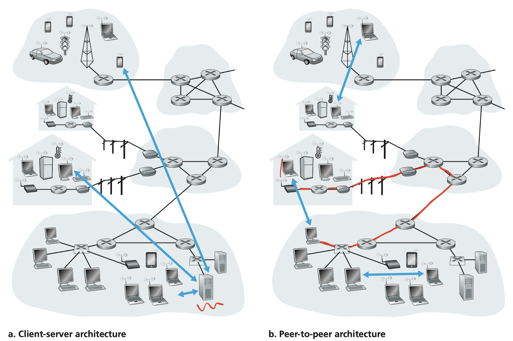
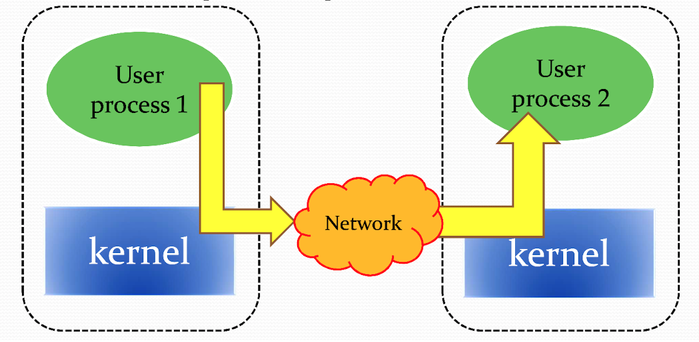
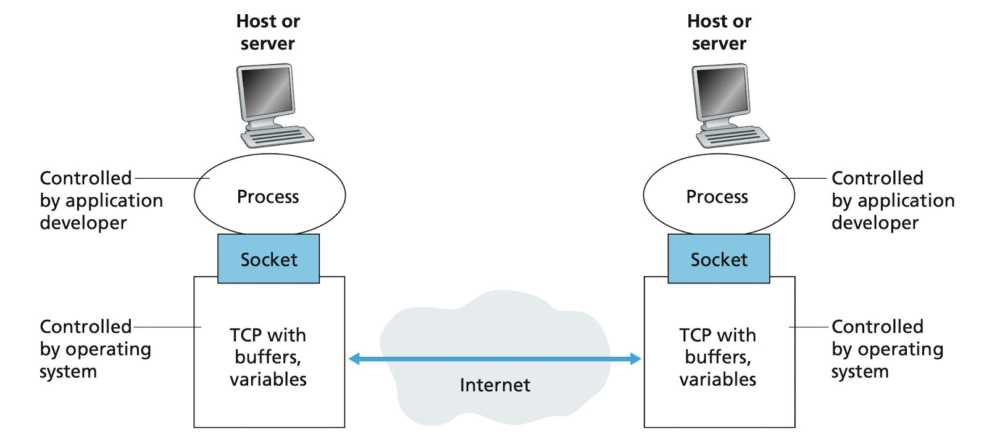

# Application Layer

[[toc]]

If we couldn't conceive of any useful applications, there wouldn't be any need for networking infrastructure and protocols to support them. Since the Internet's inception, numerous useful and entertaining applications have indeed been created. These applications have been the driving force behind the Internet's success, motivating people in homes, school, governments, and businesses to make the Internet an integral part of their daily activities.

## Principles of Network Applications
When developing your new applications, the software could be written, for example, in C, Java, or Python. You do not need to (and cannot) write software that runs on network-core devices, such as routers or link-layer switches. As we learned in chapter 1, network-core do not function at the application layer but lower layers (the network layer and below). This confines **application software** to the **end systems**.

### Network Application Architectures
#### Client-server architecture
A **server** is always-on and services requests from many other hosts, called **client**. In such architecture, clients do not directly communicate with each other; for example, in Web application, two browsers do not directly communicate. 

Another characteristic of the client-server architecture is that the server has a **fixed**, well-known address, called an IP address. Since it's always-on clients can always contact the server by sending a packet to the server's IP address. Some of the better-known applications with such architecture include the Web, FTP, Telnet and e-mail.



> Image credit to Computer Networking: A Top-down Approach, 7th Edition

##### Data center
The most popular Internet services–such as 

- Search engines
    - Google
    - Bing
- Internet commerce
    - Amazon
    - eBay
- Web-based email
    - Gmail
    - Yahoo Mail
- Social networking
    - Facebook
    - Instagram
    - Twitter
    - YouTube

If each of them has only one server handling all of its requests, it can quickly become overwhelmed. For this reason, these services employ one or more **data center**. A data center can have hundreds of thousands of servers, which must be powered, maintained, and **cooled down**. In fact, the cost to cool down all these servers, i.e., computers, is way higher than the electricity bills. Companies like Microsoft actually seals their data centers and drop them into the oceans to cool them down at a low cost.

#### P2P architecture
Instead of the reliance on dedicated servers in data center, the application exploits direct communication between pairs of intermittently connected hosts, called **peers**, which mostly reside in homes, universities, and offices. Because the peers communicate without passing through a dedicated server, the architecture is called peer-to-peer. Many of today’s most popular and traffic-intensive applications are based on P2P architectures. These applications include

- File sharing – BitTorrent
- Peer-assisted download acceleration – Xunlei
- Internet telephony and video conference
    - Skype
    - Zoom (hybrid)

Because of COVID-19, Zoom has earned a considerable fame. It's partly because of its support of both cloud-based and P2P architectures. Besides Zoom, many instant messaging applications also employ the hybrid architecture, with servers are used to track the IP addresses of users, but user-to-user messages are sent directly between user hosts. Without passing through intermediate servers, they provide a better security guarantee. Sadly, one of the biggest messaging application, **LINE** is not one of them, thus LINE has full control over the messages between users.

One of the most compelling features of P2P architectures is their **self-scalability**. For example, in a P2P file-sharing application, although each peer generates workload by requesting files, each peer also adds service capacity to the system by distributing files to other peers. P2P architectures are also cost effective, since they normally don’t require significant server infrastructure and server bandwidth (in contrast with clients-server designs with data centers). However, P2P applications face challenges of security, performance, reliability, and of course, copyright issue due to their highly decentralized structure.

### Processes Communicating

It's not actually your programs but **processes** that communicate. When processes are running on the same device, they can communicate with each other with interprocess communications, using rules that are governed by the operating system (usually through the kernel). With the same analogy, processes on two different end systems communicate by the Internet bridge between two kernels.



> Image credit to Prof. Y.C. Wang

#### Client and Server Processes
For each pair of communicating processes, we typically label one of them as the **client** and the other process as the **server**.

| Application      | Client                      | Server                    |
|------------------|-----------------------------|---------------------------|
| Web              | Browser                     | Web server                |
| P2P file-sharing | Peer that downloading files | Peer that uploading files |

You may find that in some applications, such as in P2P file sharing, a process can be bith a client and a server. Indeed, a process in a P2P file-sharing system can both upload and download files. Nevertheless, we can still label the processes as the client and the server.
##### Definition

> In the context of a communication session between a pair of processes, the process that initiates the communication (that is, initially contacts the other process at the beginning of the session) is labeled as the client. The process that waits to be contacted to begin the session is the server.
##### Client

- Communicate with server
- May be intermittently connected
- May have dynamic IP address
- Do not communicate directly with each other

##### Server

- Always-on host
- Permanent IP address
- Data center for scaling

#### The interface between the process and the computer network
A process sends messages into, and receives message from, the network through a software interface called a **socket**



> Image credit to Computer Networking: A Top-down Approach, 7th Edition

As shown in the figure, a socket is the interface between the application layer and the transport layer within a host. It's also referred to as the **Application Programming Interface (API)** between the application and the network. The application developer has control of everything on the application-layer side of the socket but has little control of the transport-layer side of the socket.

> Just like in ML frameworks, such as Pytorch, you have control over the network structure, training procedures, etc. But you don't have to bother with how the gradients are computed.

The only control that the application developer has on the transport-layer side is 

1. The choice of transport protocol (TCP/UDP)
1. The ability to fix a few transport-layer parameters such as maximum buffer and maximum segment sizes

#### Addressing processes
To identify the receiving process, two pieces of information need to be specified

1. The address of the host (IP address)
1. An identifier that specifies the receiving process in the destination host (port number)

The **IP address** is where your computer located in the Internet. However, in general a computer could be running many network applications. A destination **port number** serves this purpose. Popular applications have been assigned specific port numbers

| Service name          | Port     |
|-----------------------|----------|
| FTP                   | 20, 21   |
| SSH                   | 22       |
| Telnet                | 23       |
| SMTP                  | 25       |
| DNS                   | 53       |
| HTTP                  | 80       |
| HTTPS (HTTP with SSL) | 443      |
| FTP over SSL/TLS      | 989, 990 |

### Transport Services Available to Applications
What are the services that a transport-layer protocol can offer to applications invoking it? We can broadly classify the possible services along four dimensions

1. Reliable data transfer (data integrity)
1. Throughput (bandwidth)
1. Timing (latency, delay)
1. Security

#### Reliable data transfer
If a protocol provides such a guaranteed data delivery service, it is said to provide **reliable data transfer**. When a transfer protocol provides this service, the sending process can just pass its data into the socket and know with complete confidence that the data will arrive without errors at the receiving process.

In contrast, when a transport-layer protocol doesn't provide reliable data transfer, some of the data sent by the sending process may never arrive at the receiving process. This may be acceptable for **loss-tolerant applications**, such as multimedia streaming, lost data might result in a small glitch in the audio/video–not a crucial impairment.

#### Throughput
Because many sessions share the bandwidth along the network path, the available throughput can fluctuate with time. This leads to a natural service that a transport-layer protocol could provide, namely, guaranteed available throughput at some specified rate. With such a service, the application could request a guaranteed throughput of $r$ bits/sec, and then the transport protocol would then ensure that the available throughput is always at least $r$ bits/sec.

Such a guaranteed throughput service would greatly appeal to many applications. For example, Internet audio/video telephony application encodes data at a fixed rate. It needs to send data into the network and have data delivered to the receiving application at this rate. Since in a call, data is generated every second. If the network can not keep up with that rate, the telephony service would be of no use.

Some application, like YouTube, use adaptive coding techniques to encode digitized video at a rate that matches the currently available throughput. So if an instant throughput can only support the quality of 360p, YouTube will set it to 360p to guarantee a steady playback.

While bandwidth-sensitive applications have specific throughput requirements, **elastic applications** can make use of as much, or as little, throughput as happens to be available. The most pervasive example is nothing but downloading files. Of course, the more throughput, the faster download rate.

#### Timing
An example guarantee might be that every bit that the sender pumps into the socket arrives at the receiver’s socket no more than 100 msec later. Such a service would be appealing to interactive real-time applications, such as Internet telephony and multiplayer games. Like in the popular game, League of Legends, the ping value indicated the time it takes for data to travel between your computer and the game server. If the latency is too high, you might encounter a unpleasant gameplay experience as every skill you cask would take affect after 1 second.

#### Security
A transport protocol can encrypt all data transmitted by the sending process; and in the receiving host, the transport-layer protocol can decrypt the data before delivering the data to the reviving process. Such a service would provide confidentiality between the two processes, even if the data is somehow observed between sending and receiving processes.

### Transport Services Provided by the Internet
#### TCP services
##### Connection-oriented service
TCP has the client and server exchange transport-layer control information with each other **before** the application-level messages begin to flow. This so-called handshaking procedure alerts the client and server, allowing them to prepare for an onslaught of packets. After the handshaking phase, a **TCP connection** is said to exist between the sockets of the two processes. The connection is a full-duplex connection in that the two processes can send messages to each other over the connection at the same time. When the application finishes sending messages, it must tear down the connection.

##### Reliable data transfer service
The communicating processes can rely on TCP to
deliver all data sent without error and in the proper order. When one side of the application passes a stream of bytes into a socket, it can count on TCP to deliver the same stream of bytes to the receiving socket, with no missing or duplicate bytes.

| Application            | Data Loss     | Throughput         | Time-Sensitive      |
|------------------------|---------------|--------------------|---------------------|
| File transfer/download | No loss       | Elastic            | No                  |
| E-mail                 | No loss       | Elastic            | No                  |
| Web document           | No loss       | Elastic (few kbps) | No                  |
| Internet telephony     | Loss-tolerant | few kbps-1Mbps     | 100ms               |
| Video conferencing     | Loss-tolerant | 10kbps-5Mbps       | 100ms               |
| Streaming audio/video  | Loss-tolerant | same as above      | few seconds         |
| Interactive games      | Loss-tolerant | few kbps-10kbps    | 50ms                |
| Smartphone messaging   | No loss       | Elastic            | No more than 10 min |

TCP also includes a congestion-control mechanism, which throttles a sending process when the network is **congested** between sender and receiver to prevent packet loss. It also attempts to limit each TCP connection to its fair share of network bandwidth.

##### Secure sockets layer (SSL)
SSL is not another Internet transport protocol but instead is an enhancement of TCP, with the enhancements being implemented in the application layer. In particular, if an application wants to use the services of SSL, it needs to include SSL libraries in both the client and server sides of the application. When an application uses SSL

1. The sending process passes the encrypted data to the TCP socket. 
1. The encrypted data travels over the Internet to the TCP socket in the receiving process.
1. The receiving socket passes the encrypted data to SSL, which decrypts the data.
1. SSL passes the clear text data through its SSL socket to the receiving process.

#### UDP services
UDP is connectionless, so there is no handshaking before the two processes start to communicate. UDP provides an unreliable data transfer service–that is, UDP provides no guarantee that the message will ever reach the receiving process. Furthermore, messages may arrive out of order. UDP also does not include a congestion-control mechanism, so the sending side of UDP can pump data into the layer below at any rate it please.

#### Services not provided by Internet transport protocols
Let's recap four services motioned above

1. Reliable data transfer
1. Throughput
1. Timing
1. Security

We have already noted that TCP provides reliable end-to-end data transfer and security services through SSL. How about the other two services? Throughput and timing. Today's Internet can often provide satisfactory service to time-sensitive applications, but it cannot provide nay timing or throughput guarantees.

Typically, e-mail, SSH, the Web, and file transfer all use TCP. These application have chosen it basically because TCP provides reliable data transfer, guaranteeing that all data will eventually get to its destination. On the other hand, Internet telephony application (such as Skype) can often tolerate some loss but require a minimal rate to be effective. Developers of which prefer to run their applications over UDP. However, because many firewalls are configured to block UDP traffic, Internet telephony applications often are designed to use TCP as a backup if UDP communication fails.

<!--

### Application-Layer Protocols
### Network Applications Covered in This Book

-->

## The Web and HTTP
### Overview of HTTP
The **HyperText** Transfer Protocol (HTTP), the Web's application-layer protocol, is at the heart of the Web. It's implemented in two programs: a client program and a server program. HTTP defines the structure of these messages and how the client and server exchange the messages.

A Web page consists of objects. An object is simply a file, typically **HTML** file, a JPEG image or a JavaScript. Each object is addressable by a **URL**, e.g.
```
http://www.hsnl.cse.nsysu.edu.tw/wklai/index.html
|______________________________| |______________|
    └──> host name                   └──> path name
```
The host name can be resolved into an IP address for a server, while the path name typically reflects the actually file structure on that server. The file name `index.html` is for a special file which can be addressed by the directory containing it. For example, `http://www.hsnl.cse.nsysu.edu.tw/wklai/` directs to the same page as above.

#### HTTP client and server

**Client**

HTTP clients typically are browsers that request, receive, and display Web object (rendering HTML DOM). When you enter an URL on a browser

1. It tries to make a connection with the host (referring to the host name above). 
1. When a connection is established, it makes a HTTP request (typically GET) to get the file (referring to the path name above). 
1. If it is an HTML file, then the browser render out the HTML DOMs (as everything you've on this webpage)


We can also **not** use a browser to request a webpage. Try this

```sh
echo "GET /wklai/" | nc www.hsnl.cse.nsysu.edu.tw 80 | less
```

However, no one help us render the HTML file, so we'll see raw HTML texts. The command above makes a connection with the Lai's website using `nc`, then send a request to get the object.

**Server**

Web server host Web objects which typically are 

1. HTML files
1. CSS style sheets
1. JavaScript (This can generate an entire web application nowadays. Vue.js, React)
1. PHP files (server-side render)
1. Multimedia

A server need to handle concurrency since it should serve multiple clients concurrently. Three software are mainly used in the Web servers.

1. Nginx
1. Apache
1. Microsoft IIS

These software aim to deal with large amount of connections, memory usage reduction, speed and so on. Another important job for them is serving as **reverse proxies**, which basically provide a single server entry for the clients but distribute different jobs to servers/computer inside the company networks hidden from the clients.

An application server is also frequently used in the modern websites. It can be written in 

1. PHP/Laravel
1. Java/Spring
1. Node.js/Express
1. Python/Django

This kind of servers provide business logics, Database interactions, UI independent tasks for the dynamic web contents. For example, a forum website hosts lots of issues from the users. These issues are presented in the same UI structure but the contents are different. Therefore, a HTML template can be used across the forum and an application server is responsible to provide the content **dynamically**.

The application servers can also handle concurrency but the **Web server** typically has done it by properly distributing the requests to them.


<!--

### Non-Persistent and Persistent Connections
### HTTP Message Format
### User-Server Iteration: Cookies
### Web Caching

## Electronic Mail in the Internet
### SMTP
### Comparison with HTTP
### Mail Message Formats
### Mail Access Protocols

## DNS–The Internet's Directory Service
### Services Provided by DNS
### Overview of How DNS Works
### DNS Records and Messages

## Peer-to-Peer Applications
### P2P File Distribution

## Video Streaming and Content Distribution Networks
### Internet Video
### HTTP Streaming and DASH
### Content Distribution Networks
### Case Studies: Netflix, YouTube, and Kankan

## Socket Programming: Creating Network Applications
### Socket Programming with UDP
### Socket Programming with TCP

## Summary

-->
