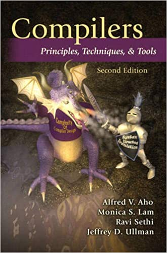

# Introduction
## CSE360 Design And Implementation of Compiler
#### Spring 2021
#### National Sun Yat-sen University

## Instructor
#### Ye-In Chang ([website](http://db.cse.nsysu.edu.tw))

## Materials
The materials used in this course include slides and textbooks. The slides are not provided due to the copyright issue. Here's the textbooks list.

1. Compilers: Principles, Techniques, and Tools 2nd Edition (ISBN: 978-0321486813)

> Image from Amazon

## Notes
This website includes the notes I took throughout the course. The contents are mainly taken from the professor's slides, textbook plus some personal explanations.
### Table of contents

1. Compiler Design
1. Lexical Analysis
    - Finite Automata
    - From Regular Expressions to Automata
    - Optimization of DFA-Based Pattern Matchers
1. Syntax Analysis
    - Context-Free Grammers
    - Writing a Grammer
    - Top-Down Parsing
