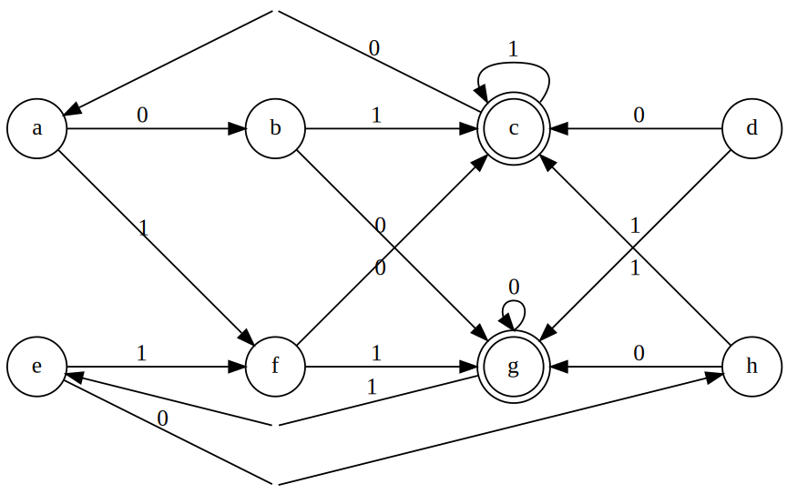
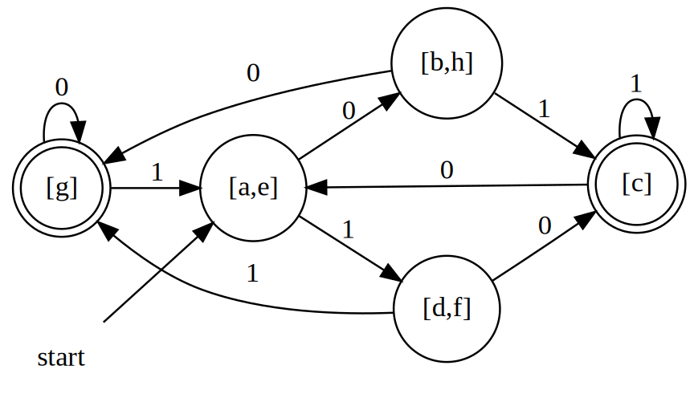
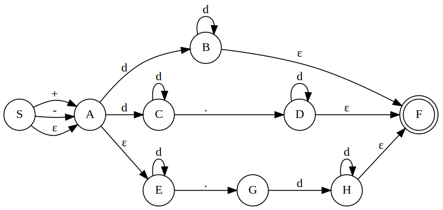

# Optimization of DFA-Based Pattern Matchers
## Minimizing the Number of State of a DFA
There can be many DFA's that recognize the same language. Not only do these automata have states with different names, but they don't even have the same number of states. If we implement a lexical analyzer as a DFA, we would generally prefer a DFA with as few states as possible.

**Rules for minimization**

For states $s$ and $t$ in a finite automata, they can be merged if and only if for all input symbol $a$, states $s$ and $t$ both have transitions on $a$ to

1. non-final states
1. the same final state

### Example
Minimize the following DFA transition graph

In the following table, each entry shows whether two sets can be merged, while the upper-right triangle is redundant.

|   | a  | b  | c | d  | e | f | g |
|---|----|----|---|----|---|---|---|
| b |    | —  | — | —  | — | — | — |
| c |    |    | — | —  | — | — | — |
| d |    |    |   | —  | — | — | — |
| e | ✅ |    |   |    | — | — | — |
| f |    |    |   | ✅ |   | — | — |
| g |    |    |   |    |   |   | — |
| h |    | ✅ |   |    |   |   |   |

Consequently, we get these new state

## Advanced NFA-to-DFA Conversion
Consider the regular expression, NFA transition graph and the corresponding transition table

`(+|-)?(d+|d+.d*|d*.d+)`

|                                                                                | + | - | . | d    | ε |
|--------------------------------------------------------------------------------|---|---|---|------|---|
| S                                                                              | A | A |   |      | A |
| A                                                                              |   |   |   | B, C | E |
| B                                                                              |   |   |   | B    | F |
| C                                                                              |   |   | D | C    |   |
| D                                                                              |   |   |   | D    | F |
| E                                                                              |   |   | G | E    |   |
| &nbsp;F&nbsp; |   |   |   |      |   |
| G                                                                              |   |   |   | H    |   |
| H                                                                              |   |   |   | H    | F |
