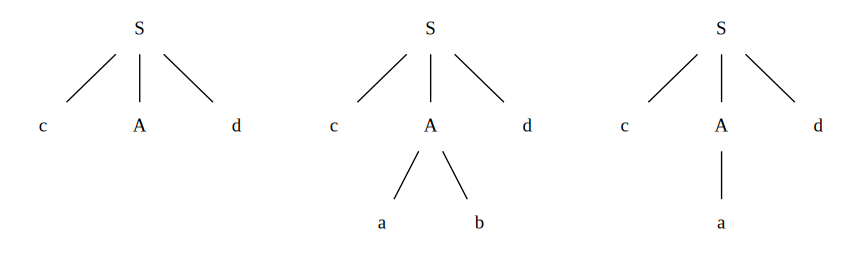
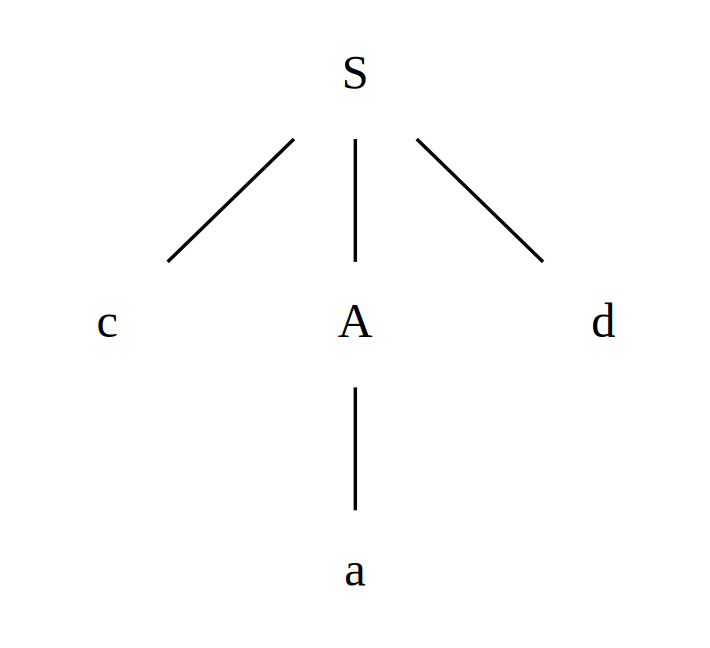
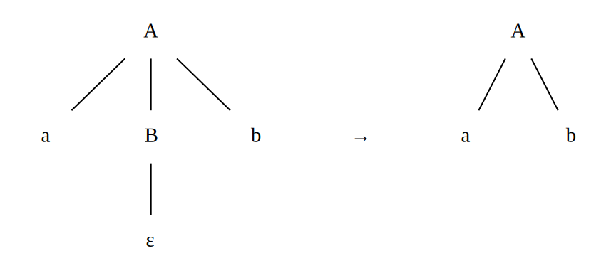

# Top-Down Parsing
The section begins with a general form of top-down parsing, called recursive-descent parsing, which may require backtracking to find the correct $A$-production to be applied. Later we'll introduce predictive parsing, a special case of recursive-descent parsing, where **no backtracking** is required. Predictive parsing chooses the correct $A$-production by looking ahead at the input a fixed number of symbols, typically we may look only at one (that is, the next input symbol).

## Recursive-Descent Parsing
Consider the grammar

$$\begin{matrix}
S & \rightarrow & cAd \\
A & \rightarrow & ab \; \vert \; a \\
\end{matrix}$$

To construct a parse tree top-down for the input string $w = cad$, begin with the starting node $S$, and the input pointer pointing to the first character from left to right of the input, i.e., $c$.

1. Since $S$ has only one production, we use it to expand $S$ and obtain the tree of the lhs of the figure below.
1. The leftmost leaf, labeled $c$, matches the first symbol of input $w$, so we advance the input pointer to $a$. Now, use the first alternative $A \rightarrow ab$ to obtain the tree of the middle of the figure below.
1. Since $b$ does not match $d$, we report failure and go back to $A$ and retract the input pointer to seek for another alternative producing a match. The second alternative $A -> a$ produces the tree of rhs of the figure below. The leaf $a$ and $d$ match to the second and the third symbols of $w$ respectively, we halt and annouce successful completion of parsing.



Noted that a left-recursive grammar can cause a recursive-descent parser, even one with backtracking, to go into an infinite loop. That's why we've talked about the [elimination of left recursion](./writing-a-grammar.md#elimination-of-left-recursion). Also, the backtracking is not an efficient way to construct a parse tree, thus we shall see how to predict the right alternative below.

## FIRST Set
### Why FIRST
**Consider the production rule**

$$\begin{matrix}
S & \rightarrow & cAd \\
A & \rightarrow & bc \; \vert \; a \\
\end{matrix}$$

Assume the input string is $cad$. Scanning from left to write, upon reading $c$, we know that $S \rightarrow cAd$ may be applicable but only if $A$ produces a string led by $a$. Therefore, we need to know what comes first in $A$, i.e. $FIRST \lparen A \rparen$.

In this case, $FIRST \lparen A \rparen = \{b, a\}$, so we can tell that $A$ is applicable and use the production rule $A \rightarrow a$ to build the following parse tree.



### Rules for FIRST set
To compute $FIRST(X)$ for all grammar symbol $X$, apply the following rules until no more terminals or $\epsilon$ can be added to any FIRST set.

1. If $X$ is a terminal, then $FIRST(X) = \{X\}$.
1. If $X$ is a nonterminal and $X \rightarrow Y_1Y_2 \cdots Y_k$ is a production for some $k\geq 1$
    - Place $a$ in $FIRST(X)$ if for some $i$, $a$ is in $FIRST(Y_i)$, and  $\epsilon$ is in all of $FIRST(Y_1), \cdots , FIRST(Y_{i-1})$, i.e., $Y_1 \cdots Y_{i-1} \xRightarrow{*} \epsilon$.
    - Add $\epsilon$ to $FIRST(X)$ if $\epsilon$ is in $FIRST(Y_j)$ for all $j = 1, 2, \cdots ,k$.
3. If $X \rightarrow \epsilon$ is a production, then add $\epsilon$ to $FIRST(X)$.

::: tip Elaboration on the Rules

1. For example, suppose $A \rightarrow \alpha \; \vert \; \lparen B \rparen$, then $FIRST(A) = \{ \alpha , \lparen \}$, where $\alpha$ and $\lparen$ are terminals
1. For example, everythin in $FIRST(Y_1)$ is surely in $FIRST(X)$. If $Y_1$ does not derive $\epsilon$, then we add nothing more to $FIRST(X)$, but if $Y_1 \xRightarrow{*} \epsilon$, then we add $FIRST(Y_2)$, and so on.
1. The rule should be self-explanatory.

:::

### A simple example
Consider the production rules below

$$\begin{matrix}
E  & \rightarrow & TE' \;\;\;\;\;\;\; \\
E' & \rightarrow & +TE' \; \vert \; \epsilon \\
T  & \rightarrow & FT' \;\;\;\;\;\;\; \\
T' & \rightarrow & *FT' \; \vert \; \epsilon \\
F  & \rightarrow & \lparen E \rparen \; \vert \; \bold{id} \\
\end{matrix}$$

Find the FIRST sets for the nonterminals
::: tip Solutoin
```
FIRST(F) = {(}
FIRST(F) = {(, id}

FIRST(E') = {+}
FIRST(E') = {+, ε}

FIRST(T') = {+}
FIRST(T') = {+, ε}

FIRST(T) = FIRST(F) = {(, id}
FIRST(E) = FIRST(T) = {(, id}
```

| Nonterminal | FIRST Set                  |
|-------------|----------------------------|
| $E$         | $\{ \lparen , \bold{id}\}$ |
| $E'$        | $\{+, \epsilon \}$         |
| $T$         | $\{ \lparen , \bold{id}\}$ |
| $T'$        | $\{*, \epsilon \}$         |
| $F$         | $\{ \lparen , \bold{id}\}$ |

:::


## FOLLOW Set
### Why FOLLOW
**Consider the production rule**

$$\begin{matrix}
A & \rightarrow & aBb \\
B & \rightarrow & c \; \vert \; \epsilon \\
\end{matrix}$$

Suppose the string to parse is $ab$. Scanning from left to write, upon reading $a$, we know that $A \rightarrow aBb$ may be applicable but only if $B$ can vanish **and the character follows  $B$ is $b$**. That's why we need to know what follows $B$, i.e. $FOLLOW \lparen B \rparen$

In this case, $FOLLOW \lparen B \rparen = \{b\}$ and the current input (after scanned $a$) is $b$. Hence the parser applies this rule and generate the following parse tree



### Rules for FOLLOW set
To compute $FOLLOW(A)$ for all nonterminals $A$, apply the following rules until nothing can be added to any FOLLOW set.

1. Place $\$$ in $FOLLOW(S)$, where $S$ is the start symbol, and $\$$ is the input right endmarker.
1. If there is a production $A \rightarrow \alpha B \beta$, then everything in $FIRST(\beta)$ except $\epsilon$ is in $FOLLOW(B)$.
1. If there is a production $A \rightarrow \alpha B$, or a production $A \rightarrow \alpha B \beta$, where $FIRST(\beta)$ contains $\epsilon$, then everything in $FOLLOW(A)$ is in $FOLLOW(B)$.

### A simple example
Continue the example above

$$\begin{matrix}
E  & \rightarrow & TE' \;\;\;\;\;\;\; \\
E' & \rightarrow & +TE' \; \vert \; \epsilon \\
T  & \rightarrow & FT' \;\;\;\;\;\;\; \\
T' & \rightarrow & *FT' \; \vert \; \epsilon \\
F  & \rightarrow & \lparen E \rparen \; \vert \; \bold{id} \\
\end{matrix}$$

| Nonterminal | FIRST Set                  |
|-------------|----------------------------|
| $E$         | $\{ \lparen , \bold{id}\}$ |
| $E'$        | $\{+, \epsilon \}$         |
| $T$         | $\{ \lparen , \bold{id}\}$ |
| $T'$        | $\{*, \epsilon \}$         |
| $F$         | $\{ \lparen , \bold{id}\}$ |

Find the FOLLOW sets for the nonterminals

::: tip Solution
```
FOLLOW(E) = {$}
FOLLOW(E) = {$, )}

FOLLOW(E') = FOLLOW(E) = {$, )}

FOLLOW(T) = FIRST(E') - {ε} = {+}
FOLLOW(T) = {+} ∪ FOLLOW(E) = {+, $, )}

FOLLOW(T') = FOLLOW(T) = {+, $, )}

FOLLOW(F) = FIRST(T') - {ε} = {*}
FOLLOW(F) = {*} ∪ FOLLOW(T) = {*, +, $, )}

```

| Nonterminal | FOLLOW Set                                   |
|-------------|----------------------------------------------|
| $E$         | $\{ \text{\textdollar} , \lparen \}$         |
| $E'$        | $\{ \text{\textdollar} , \lparen \}$         |
| $T$         | $\{ + , \text{\textdollar} , \lparen \}$     |
| $T'$        | $\{ + , \text{\textdollar} , \lparen \}$     |
| $F$         | $\{ * , + , \text{\textdollar} , \lparen \}$ |

:::


## LL(1) Grammars
Predictive parsers, that is, recursive-descent parsers needing no backtracking, can be constructed for a class of grammars called **LL(1)**. 

1. The first "L" in LL(1) stands for scanning the input from **left to right**, 
1. The second "L" for producing a **leftmost derivation**
1. The "1" for using **one input** symbol of lookahead at each step to make parsing action decisions.
