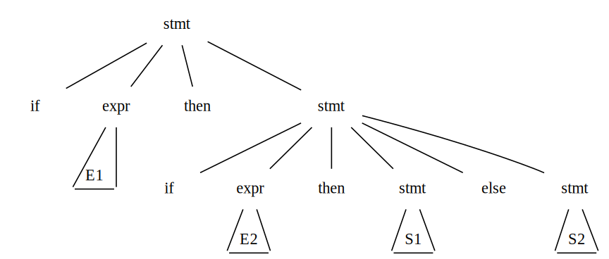
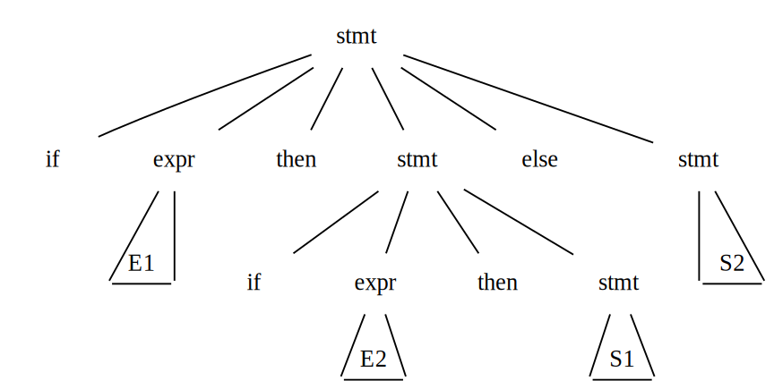

# Writing a Grammer
This section begins with a discussion of how to divide work between a lexical analyzer and a parser. We then consider several transformations that could be applied to get a grammar more suitable for parsing. One technique can **eliminate ambiguity** in the grammar, and other techniques, **left-recursion elimination** and **left factoring**, are useful for rewriting grammars so they become suitable for **top-down parsing**.

## Lexical Versus Syntactic Analysis
We typically use **regular expressions** to construct **lexical analyzers** while using **grammars** to constuct **parsers**. In fact, everything that can be described by a regular expression can also be described by a grammar. We may ask, why use regular expressions to define the lexical syntax. There are serveral reasons:

1. The lexical rules of a language are frequently quite simple, and to describe them we do not need a notation as powerful as grammars.
1. Regular expressions generally provide a more concise and easier-to-understand notation for tokens than grammars.

## Eliminating Ambiguity
Sometimes an ambiguous grammar can be rewritten to eliminate the ambiguity. As an example, we shall eliminate the ambiguity from the following "dangling-else" grammar:

$$\begin{matrix}
\textit{stmt}   & \rightarrow   & \bold{if} \; \textit{expr} \; \bold{then} \; \textit{stmt} \;\;\;\;\;\;\;\;\;\;\;\;\;\;\;\; \\
                & \vert         & \bold{if} \; \textit{expr} \; \bold{then} \; \textit{stmt} \; \bold{else} \; \textit{stmt} \\
                & \vert         & \bold{other} \;\;\;\;\;\;\;\;\;\;\;\;\;\;\;\;\;\;\;\;\;\;\;\;\;\;\;\;\;\;\;\;\;\; \\
\end{matrix}$$ (1)

Here $other$ stands for any other statement. According to this grammar, the compound conditional statement

$$\bold{if} \; E_1 \; \bold{then} \; S_1 \; \bold{else} \; \bold{if} \; E_2 \; \bold{then} \; S_2 \; \bold{else} \; S_3$$

is an example showing Grammar (1) is ambiguous since it has two parse trees

In all programming languages with conditional statements of this form, the **first** parse tree is preferred. The general rule is, Match each $\bold{else}$ with the **closest** unmatched $\bold{then}$. This disambiguating rule can be incorporated directly into a grammar by using the following observations.

- A statement appearing between a $\bold{then}$ and a $\bold{else}$ must be matched ($\bold{if}\text{-}\bold{then\text{-}else}$ pairs).
- Thus statements must split into kinds: $\textit{matched}$ and $\textit{unmatched}$.
- The unambiguous grammar for $\bold{if}\text{-}\bold{then\text{-}else}$ statements can be described as 

$$\begin{matrix}
\textit{stmt}               & \rightarrow   & \textit{matched\_stmt} \;\;\;\;\;\;\;\;\;\;\;\;\;\;\;\;\;\;\;\;\;\;\;\;\;\;\;\;\;\;\;\;\;\;\;\;\;\;\;\;\;\;\;\;\;\;\;\;\;\;\;\;\;\; \\
                            & \vert         & \textit{unmatched\_stmt} \;\;\;\;\;\;\;\;\;\;\;\;\;\;\;\;\;\;\;\;\;\;\;\;\;\;\;\;\;\;\;\;\;\;\;\;\;\;\;\;\;\;\;\;\;\;\;\;\;\; \\
\textit{matched\_stmt}      & \rightarrow   & \bold{if} \; \textit{expr} \; \bold{then} \; \textit{matched\_stmt} \; \bold{else} \; \textit{matched\_stmt} \;\;\; \\
                            & \vert         & \bold{other} \;\;\;\;\;\;\;\;\;\;\;\;\;\;\;\;\;\;\;\;\;\;\;\;\;\;\;\;\;\;\;\;\;\;\;\;\;\;\;\;\;\;\;\;\;\;\;\;\;\;\;\;\;\;\;\;\;\;\;\;\;\;\;\;\;\; \\
\textit{unmatched\_stmt}    & \rightarrow   & \bold{if} \; \textit{expr} \; \bold{then} \; \textit{stmt} \;\;\;\;\;\;\;\;\;\;\;\;\;\;\;\;\;\;\;\;\;\;\;\;\;\;\;\;\;\;\;\;\;\;\;\;\;\;\;\;\;\;\;\;\;\;\;\;\; \\
                            & \vert         & \bold{if} \; \textit{expr} \; \bold{then} \; \textit{matched\_stmt} \; \bold{else} \; \textit{unmatched\_stmt} \\
\end{matrix}$$

