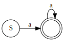
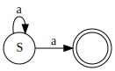

# Lecture 5

### The greps

- `fgrep`: **f**ixed-string **grep** to searches for strings (not regex).
- `grep`: **g**et **r**egular **e**xpression and **p**rint to search for regular expression patterns.
- `egrep`: **e**xtended **grep** for an alternative pattern description system (extended regex)

## fgrep
#### Important `fgrep` flags

| Flag      | Description                                                                 |
|-----------|-----------------------------------------------------------------------------|
| `-i`      | Case **i**nsensitive                                                        |
| `-n`      | Display line **n**umbers                                                    |
| `-v`      | In**v**ert the matches                                                      |
| `-w`      | **W**hole word matches                                                      |
| `-o`      | **O**nly display the matchm not the entire line containing it               |
| `-e`      | Specify **e**xpression                                                      |
| `-A`      | Set the number of lines of context to print **a**fter each match            |
| `-B`      | Set the number of lines of context to print **b**efore each match           |
| `-C`      | Set the number of lines of **c**ontext to print before and after each match |
| `--color` | Highlight the matching pattern                                              |

#### Limitation

- cannot use it to get approximate matches
- cannot use it to get matches of more complicated patterns that cannot be described by just giving a fixed string

## grep
### Regular expression (regex) symbols
| Symbol | Description                                                                                     | Example                       |
|--------|-------------------------------------------------------------------------------------------------|-------------------------------|
| `^`    | caret, as the first symbol of a regex, requires the expression to match the front of a line.    | line begins with 'A': `^A`    |
| `$`    | dollar sign, as the last symbol of a regex, requires the expression to match the end of a line. | line ends with 'Z': `Z$`      |
| `\`    | backslash, turns off special meaning for the next character.                                    | match to a literal '$': `\$`  |
| `[]`   | brackets, matches to any one of the enclosed characters.                                        | match to any vowel: `[aeiou]` |
| `.`    | period, matches to any 1 character.                                                             | a 1-character line: `^.$`     |

::: tip Special Symbols Inside Brackets
| Symbol | Description                                                                                         | Example                   |
|--------|-----------------------------------------------------------------------------------------------------|---------------------------|
| `-`    | hyphen, inside `[]`, matches to a range.                                                            | a digit: `[0-9]`          |
| `^`    | caret, as the first symbol inside `[]`, matches any one character except those enclosed in the `[]` | not a letter: `[^a-zA-Z]` |
::: warning The Position of The Caret
If the caret was not placed as the first symbol inside `[]`, for example, `[ab^cd]`, then it just represents a literal '^'.
:::

#### Regex and state machine

Regex is derived from the finite state machine.

##### Deternimistic finite state automaton (DFA)
For the same input, there is exacly one transistion (deterministic) to the next state, for example

In regex, `aa*`, expressing any sting of at least one a.

##### Nondeternimistic finite state automaton (NFA)
For the same input, there can be one or more transitions (nondeterministic) to the next state, for example

In regex, `a*a`, expressing any sting of at least one a.

### Exercise
**Problem:** Draw the NFA for this regex: `a*a*`

::: tip Answer

And the simplify/deterministic regex for it: `a*`
:::
