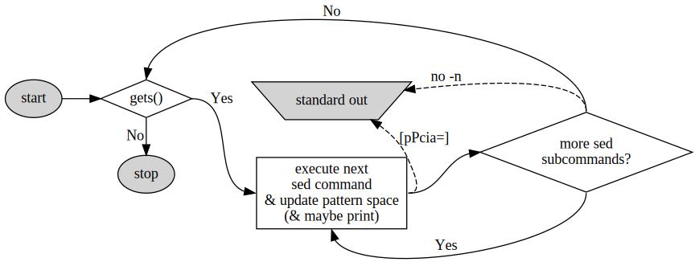

# Lecture 6
## `sed` Basic
`sed` = **S**tream **Ed**itor. `sed` uses regex, just like `grep`. Each line of the input file is processed individually by your `sed` command.

You need to tell `sed`:

1. A type of action to perform when matched
1. A pattern that you are looking for
1. The exact details of the action
1. Some flags (not the command-line flags such as `sed -n`)

For example
```sh
sed 's/exersice/exercise/g'
#    │ │        │        │
#    │ │        │        └ Flag
#    │ │        └ Detail
#    │ └ Pattern
#    └ Action
#
# In the s (substitution) action, the detail is
# a fixed-string to be substituted with
```
::: warning Separator
In the example above, the symbol `/` separating four areas is called separator. A separator is specified by the **character succeeding** the action (which is `s` above). You can use symbols that other than `/` as separators. For example
```sh
sed 's,exersice,exercise,g'
```
:::
### Useful `sed` command-line flags
| Flag | Description                                                                |
|------|----------------------------------------------------------------------------|
| `-n` | No auto-printing of the pattern space                                      |
| `-e` | Execute the command sequence specified in the argument following this flag |
| `-f` | Obtain a command sequence from a file                                      |

## Substitute
```sh
s/[pattern]/[replacement]/[flags]
```
Where the `pattern` is a regex and the `replacement` is a fixed-string

### Common substitute flags
| Flag     | Description                                                                                                       |
|----------|-------------------------------------------------------------------------------------------------------------------|
| `g`      | Replace all instances of the matches, otherwise `sed` defaults to the first instance only.                        |
| `number` | Replace only the n<sub>th</sub> instance specified by the `number`.                                               |
| `p`      | Print the line if a successful substitution is done. If `g` is used, print the line after the final substitution. |

#### Flag `g`
```sh
% cat aab_cab_B
aab
cab
B
% cat aab_cab_B | sed 's/[ab]/X/'
Xab
cXb
B
% cat aab_cab_B | sed 's/[ab]/X/g'
XXX
cXX
B
```
#### Flag `number`
```sh
% cat aab_cab_B | sed 's/[ab]/X/3'
aaX
cab
B
```
#### Flag `p`
```sh
% cat aab_cab_B | sed 's/[ab]/X/p'
Xab
Xab
cXb
cXb
B
```
The matched line are duplicate, use `p` with command-line flag `-n` instead.
```sh
% cat aab_cab_B | sed -n 's/[ab]/X/p'
Xab
cXb
```

### Reinsertion
#### Reinsert all of the matched
You can reinsert all of the matched pattern with `&`, for example
```sh
% echo "#%^&12345Hello World123454321"\
? | sed 's/[A-Za-z]\{1,\}/\nFound a word: &\n/g'
#%^&12345
Found a word: Hello
 
Found a word: World
123454321
```

### Reinsert certain groups
Same as `grep`, `\(\)` and `\number` can be used on `sed`.
```sh
% cat file | sed 's/\( p[^ ]*\)\( [^p][^ ]*\)*\( p[^ ]*\)/\1\3/'
Joe paid people
I paid people
```

### Build `grep` with `sed`
#### 1 match
```sh
#!/bin/tcsh
if ( $# == 2 ) then
    sed -n "s/$1:q/&/p" < $2
else
    sed -n "s/$1:q/&/p"
endif
```

#### 2 matches
```sh
#!/bin/tcsh
if ( $# == 2 ) then
    sed -n "s/$1:q/&/2p" < $2
else
    sed -n "s/$1:q/&/2p"
endif
```
or
```sh
#!/bin/tcsh
if ( $# == 2 ) then
    sed -n "s/$1:q.*$1:q/&/p" < $2
else
    sed -n "s/$1:q.*$1:q/&/p"
endif
```
## More `sed`
### Nested groups
When backreferencing, the group numbers are defined in the order of their `\(` symbol, i.e., where they begin. Consquently, the outer groups come before the inner groups.
```sh
% cat file 
the quick brown fox jumped over the lazy dog
% cat file | sed 's,\(the \([a-z]* \)*the\),"\1",'
"the quick brown fox jumped over the" lazy dog
% cat file | sed 's,\(the \([a-z]* \)*the\),"\2",'
"over " lazy dog
```
However, if a group was used with the `*`, regex only backreferences the last match. As you can see above, only `over` was captured.

If we want all 5 or those word (quick brown fox jump over) to be captured, the `*` has to be the left of the `\)`, but we the `*` to be right in order to capture the repetitions! The solution to this is to add the third group.
```sh
% cat file | sed 's,\(the \(\([a-z]* \)*\)the\),"\2",'
"quick brown fox jumped over " lazy dog
```

### Multiple `sed` commands
Running multiple `sed` commands using the semicolon. Let's say we want to substitute **skiing** with **hiking** and substitute **hiking** with **biking**.
```sh
% echo "Amy enjoys hiking and Ben enjoys skiing"\
? | sed 's/skiing/hiking/g; s/hiking/biking/g'
Amy enjoys biking and Ben enjoys biking
```
Not quite what we want... We was expecting something like

Amy enjoys biking and Ben enjoys <span style="color: red">hiking</span>

Let's see what happend.

1. `sed` reads in `Amy enjoys hiking and Ben enjoys skiing` and execute the first substitution command and **cache** the result in the **pattern space**, which is, `Amy enjoys hiking and Ben enjoys hiking`
1. Then the second substitution command is executed on the line in the pattern space, and the result is, `Amy enjoys biking and Ben enjoys biking`
1. The result is then written to standard out.

So we saw that the subsequent commands doesn't give what we want. We should use a single command instead.
```sh
% echo "Amy enjoys hiking and Ben enjoys skiing"\
? | sed 's/hiking\(.*\)biking/biking\1hiking/g'
Amy enjoys hiking and Ben enjoys skiing
```
### Run `sed` command from files
Use `-f` command-line flag to specify a `sed` command file. Let's see different ways to do this.
```sh
% echo; cat Way1 ; echo ----- ; cat Way2 ; echo ----- ; cat Way3

s/A/a/;s/B/b/
-----
s/A/a/
s/B/b/
-----
#!/usr/bin/sed -f
s/A/a/;s/B/b/
```
Use them
```sh
% cat F
ABC
% sed 's/A/a/;s/B/b/' < F
abC
% sed -f Way1 < F
abC
% sed -f Way2 < F
abC
% ./Way3 < F
abC
```

#### Exercise
We've learned so much! Make a sed command file should not be difficult, yet let's make it even more interesting.

Problem: what the output?
```sh
% echo \#\!'/usr/bin/sed -f%s/s/@/'\
? | tr "%" "\n"\
? | tee sedFile\
? | sed 's/s/@/';\
? | cat sedFile
```
Hint: In order to use newline in C-shell, I've used `tr` to do the trick.

::: tip Answer
```
#!/u@r/bin/sed -f
@/s/@/
#!/usr/bin/sed -f
s/s/@/
```
You got it?
:::

Now that we've created the `sed` command file, since `sed` itself is an executable, we can run it directly.
```sh
% chmod +x sedFile
% echo sss | ./sedFile
@ss
```

::: warning Pitfall: Why Doesn't My sed Script Work?
Some wrong examples you should avoid
1. Forget to add `-f` at the first line, e.g. `#!/usr/bin/sed`
1. `-f` isn't at the end of the first line, e.g. `#!/usr/bin/sed -fn`
    - Use `-nf` instead
:::

## `sed` In Depth

The implementation of `sed`
### Pseudo code
```sh
while (!EOF) {
    # step 1.
    "Load the pattern space with the next line from STDIN"
    
    # step 2.
    foreach "subcommand" within "this sed command" {
        "Use the pattern space as input to the sibcommand"

        "Do the subcommand, possibly printing to STDOUT"

        "Put the result into the pattern space"
    }

    # step 3.
    "Write the pattern space to STDOUT (if no -n flag)"
}
```
### Flow chart


### Examples
```sh
% echo "A B C" | sed 's/B/b/'
A b C # printed at step 3, due to no -n
% echo "A B C" | sed 's/B/b/p'
A b C # step 2, due to the p flag for s subcommand
A b C # step 3, no -n
% echo "A B C" | sed -n 's/B/b/p'
A b C # step 2, due to the p flag
```
```sh
% echo "A B C" | sed 's/B/b/; s/C/c/'
A b c # step 3, no -n
% echo "A B C" | sed 's/B/b/p; s/C/c/'
A b C # step 2, p flag, notice the capital C. The second subcommand has not executed yet
A b c # step 3, no -n
% echo "A B C" | sed -n 's/B/b/p; s/C/c/'
A b C # step 2, p flag
% echo "A B C" | sed 's/B/b/p; s/C/c/p'
A b C # step 2, 1st iteration
A b c # step 2, 2nd iteration
A b c # step 3, no -n
```
What if you want to use double p, `pp`
```sh
% echo "A B C" | sed -n 's/B/b/pp; s/C/c/p'
sed: -e expression #1, char 8: multiple `p' options to `s' command
```
You can't do that! Thee `s` command cannot take repeated flags. However, there is a standalone command `p`, which flush the pattern space to the standard out.
```sh
% echo "A B C" | sed -n 's/B/b/p; p; s/C/c/p'
A b C # step 2, iter 1
A b C # step 2, iter 2
A b c # step 2, iter 3
```
