# Transport Layer Protocols
## Introduction
### Jobs of trnaport layer
#### Addressing
Determine which application process a packet belongs to (through **ports**).
#### Error control
Detect if the received data is valid
#### Reliability
Ensure that the transferred data will reach its destination
#### Rate control
Adjust how fast the sender should transfer the data to the receiver (avoid packet dropping)
### UDP vs. TCP
Both **user datagram protocol (UDP)** and **transmission control protocol (TCP)** are two well-known protocols in the transport layer. But TCP is more **sophisticated** and **complicated** than UDP

| Protocol | Addressing | Error control | Reliability | Rate control |
|----------|------------|---------------|-------------|--------------|
| UDP      | ✔️          | Optional      | ❌          | ❌           |
| TCP      | ✔️          | ✔️             | ✔️           | ✔️            |

However, TCP is more difficult to implement since it needs to

- Establish an **end-to-end logical connection** between the sender and receiver
- Keep necessary **per-connection** state information

### Internet socket
When deveoping network applications, hopefully, you don't have to bother with how packets are transmitted. The Internet **socket** serves as an **API** for programmers to access the *underlying services of IP suite*. You've probably heard the term API. Think about training a neural network model. If everybody has to write their own backpropagation function to compute gradients, Deep Learning woudln't have been so popular. Instead, we use ML frameworks such as Pytoch and every function provided by Pytoch is just like an **interface** which let us build Convolution layer without knowing how it's implemented in the backend.

A good **documentation** explaining the API is a fundamental requirement for any well-known frameworks, otherwise users like us would have no idea how to use these APIs.

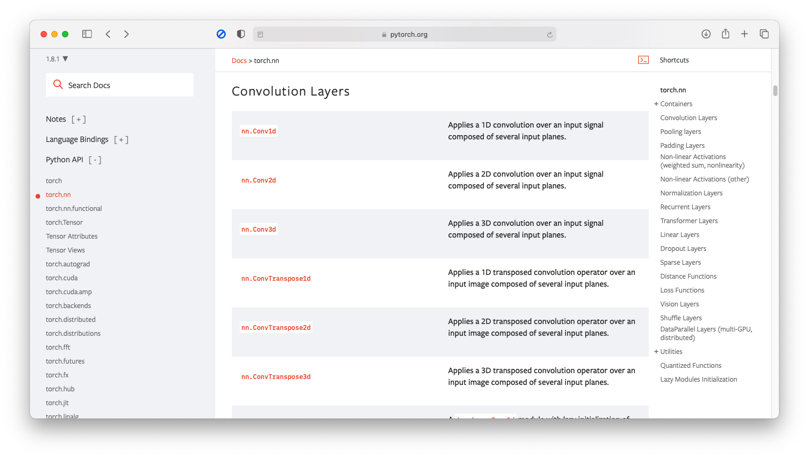

However, applications can sometimes bypass transport layer and directly use the services provided by, for example

- Network layer: routing table
- Data link layers: LAN card driver

### Communications

|                  | Host-to-host | Process-to-process   |
|------------------|--------------|----------------------|
| **Latency**      | short        | long                 |
| **Jitter**       | small        | large                |
| **Flow control** | easy         | need extra protocols |

> Jitter: you can think it as *variance*
> | small | large |
> |-------|-------|
> | 0.1s  | 0.01s |
> | 0.2s  | 0.3s  |
> | 0.1s  | 20s   |
> | 0.1s  | 0.01s |

While host-to-host communication in IP or data link layers has low latency and small jitter, the process-to-process communication has relatively opposite. Therefore, you need extra protocols (or layer) to control the flow rate in a multi-hop networ, that is **Transport layer**.

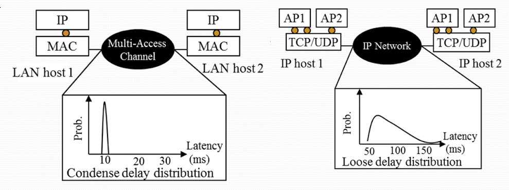

> Image credit to Professor Wang's slides

### Functions in transport layer

#### 1. Addressing

There are many process runnning on a host, so transport lyer defines the **port number** (16 bits in the Internet solution) to multiplex and demultiplex. When pacekts arrive on your computer based on the IP address, they need to knowhich process do they go next, i.e., demultiplexing. And vice versa when packets go out from each process.

Port number can be either **well-known** (e.g. SSH uses port 22) or *dynamically assigned*.

#### 2. Error control & reliability

Transport layer usually adopts cyclic redundancy check ([CRC](https://en.wikipedia.org/wiki/Cyclic_redundancy_check)) and **checksum** for error detection to guarantee data integrity. Here we give a simple example of the checksum calculation. Suppose that we have the following three 16-bit words.
```
0110011001100000
0101010101010101
1000111100001100
```
The sum of first two of these 16-bit words is
```
0110011001100000
0101010101010101
---------------- addition
1011101110110101
```
Adding the third word to the above sum gives
```
1011101110110101
1000111100001100
---------------- addition
0100101011000010
```
Note that the second addition had overflow, which the leading 1 was wrapped around and add to the trailing bit.

Finally, perform 1's complement then we get the checksum
```
0100101011000010
---------------- 1's complement
1011010100111101
```
#### 3. Rate control

- **Window-based** control regulates the sending rate by controlling the number of *outstanding* packets (i.e. a packet that has been sent but its **ACK** has not returned yet) which can be *simultaneously* in transit.
- **Rate-based** control allows the sender to directly adjust its sending rate when receiving an explicit notification of how fast it should send.

#### 4. Socket programming interface

- TCP socket vs. UDP socket
    - We'll discuss in details later
- BSD socket interface semantic
    - Explained below

### BSD socket interface
#### Procedures for outgoing packets

1. An app can choose either `sendto()` (UDP, RAW) or `write()` (TCP) to send data.
1. Allocate an `skb` buffer in kernel-space memory.
1. Copy data from user-space memory to `skb` buffer (kernel space).
1. Insert `skb` in `sk_write_queue` of [`struct sock`](https://www.kernel.org/doc/htmldocs/networking/API-struct-sock.html).
1. Push out data from the queue and forward it to the IP layer.

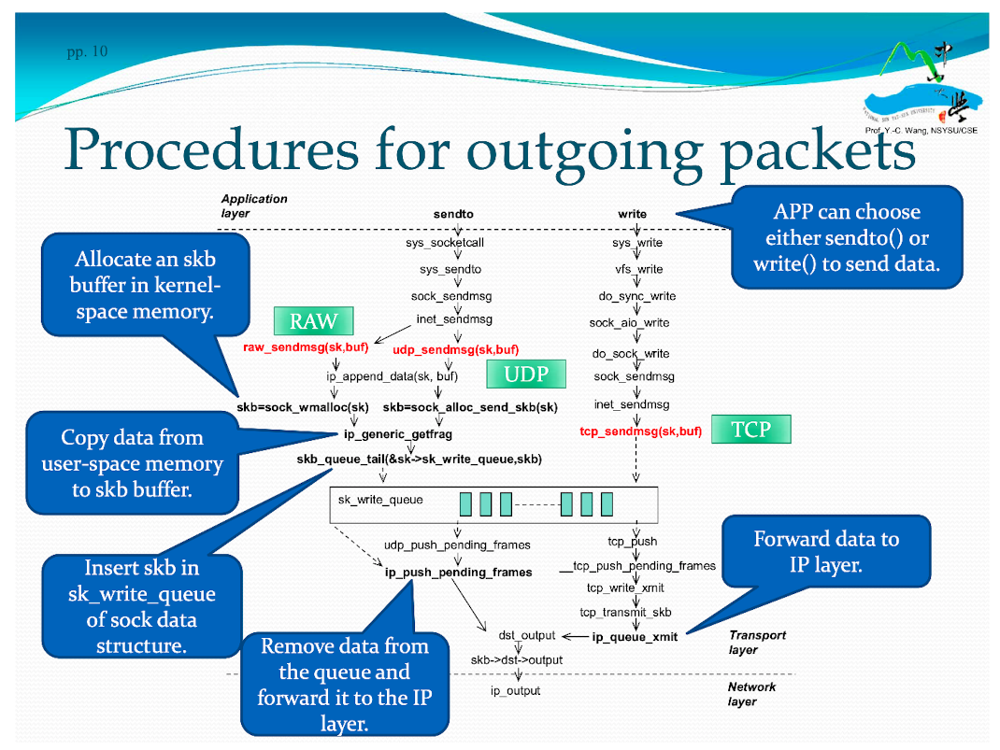

> Image credit to Professor Wang's slides

#### Procedure for incoming packets
1. An appl calls either `recvform()` (UDP, RAW) pr `read()` (TCP) to obtain data from socket data structure.
1. Call a non-blocing function call `io_local_deliver_finish` to retrieve `struck sock` of that packet and insert the received packet into flow's queue.
1. When the data is ready in the queue, notify the app taht data are available for receipt.
1. Then Remove data from queue corresponding to the flow into an `skb` space.
1. Finally, copy data from kernel-space memory to user-space one.

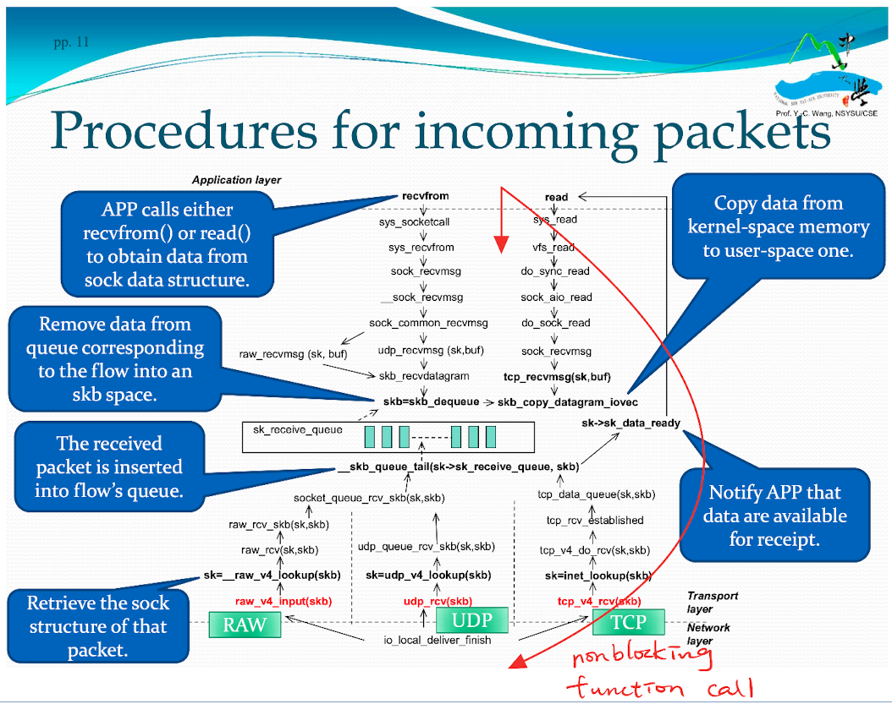

> Image credit to Professor Wang's slides

## Unreliable Protocol: UDP
UDP is used to transmit **urgent** or **real-time** data.

1. Unreliable connectionless protocol
    - Does not provide **reliability** and **rate control**.
1. Stateless protocol
    - Sending and receiving of a segment is **independent** of that of any other segments, thus packets may arrive out-of-order due to different route.

### UDP header format
UDP header supports **addressing** and error detection.
A **socket pair** of 5-tuple
1. src IP addr
1. src port
1. dst IP addr
1. dst port
1. transport portocol

uniquely identifies a communication flow.

- UDP header
    - source/destination **port numbers**
- IP header (not shown here)
    - source/destination **IP addresses** and **transport protocol**

<table>
    <tr>
        <td>0</td>
        <td>16 (bit)</td>
    </tr>
    <tr>
        <td>source port number</td>
        <td>destination port number</td>
    </tr>
    <tr>
        <td>UDP length (of data)</td>
        <td>UDP checksum (optional)</td>
    </tr>
    <tr>
        <td colspan=2>data (if any)</td>
    </tr>
</table>

Socket pair is **full-duplex**, meaning that data can be transmitted through the socket connection in *both directions simultaneously*, whereas half-duplex means one direction at a time.

#### UDP header supports addressing and **error detection**

- UDP header provides a 16-bit **checksum** for data integrity, but it can be disabled by setting the chekcsum field to zero.
- UDP receivers will *drop the datagrams* whose checksum field does not match the result they calculated *(without retransmission)*

UDP checksum field stores **1's complement** of the sum over all 16-bit words in both *header* and *payload* (not including itself obviously). We've already cover the 1's complement checksum above.

##### Cross-layer checking
UDP checksum also covers a 96-bit pseudo header, which consists of four fields in IP header

1. Source IP address, 32 bits
1. Destination IP address, 32 bits
1. Protocol, 16 bits
1. Total length, 16 bits

## Reliable Protocol: TCP

- [Connection managemnet](#connection-management)
- [Reliability of data transfers](#reliability-of-data-transfers)
- [Flow control and congestion control](#flow-control-and-congestion-control)
- [Header format and timer management](#header-format-and-timer-management)

## Connection management
In the Internet, packets are sent to their destinations in a **store-and-forward** manner

- TCP restricts the **maximum lifetime** of a packet to 120 seconds.

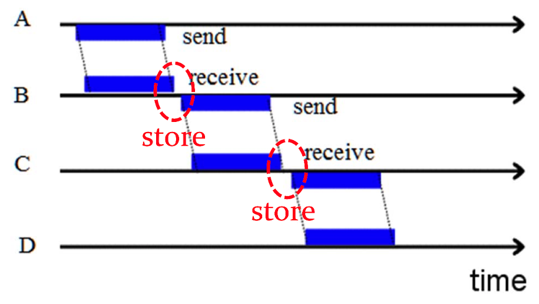

> Image credit to Professor Wang's slides

- TCP adopts a **Three-way handshake protocol** for connection establishment and termination.

When a client would like to make a request to the server, a connection must be first established. The client would sent a **SYN** (synchronize) to the server. If the server do receive the SYN, it would reply with an **ACK** acknowledgement. However, the server will also send another SYN, and if the client receive this SYN, it also reply with a ACK. When the server receive this ACK, at this moment, the connection is finally established. All of these above is so called **three-way handshaking**.

You may ask, why do we need so many SYNs and ACKs? Why don't we just use 2-way handshaking? There're many reasons for it, one of them is to enable **full-duplex**. We'll talk about other reasons later.

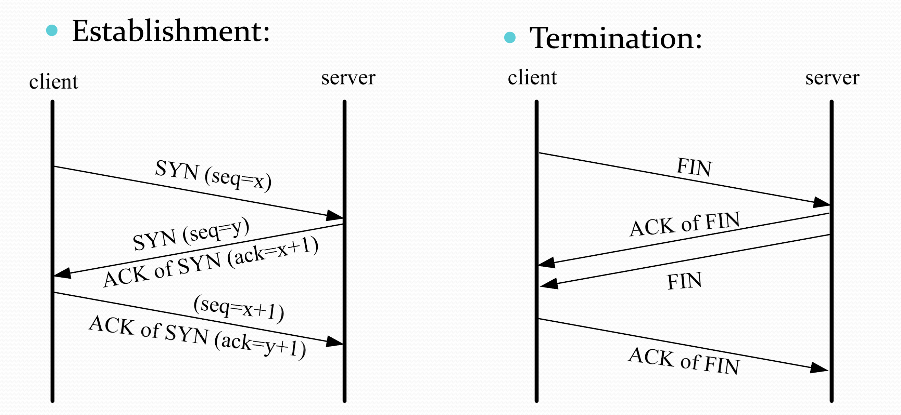

> Image credit to Professor Wang's slides

### Various connection cases
#### TCP state transition diagram
It's useful to get familiar with these states in order to understand various cases below.

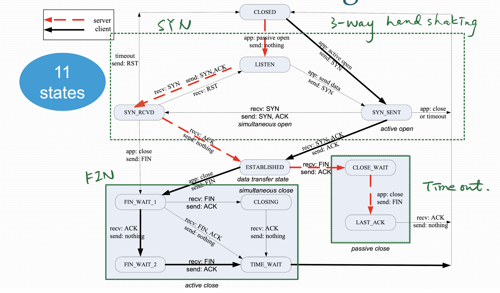

> Image credit to Professor Wang's slides

#### Normal case

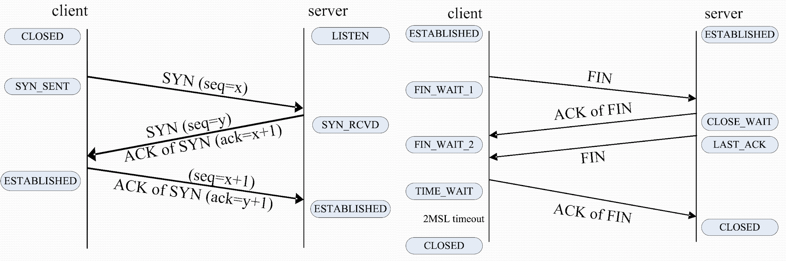

> Image credit to Professor Wang's slides

Note that during establishment (right), the client establishes the connection upon receving the first ACK, whereas the server establishes one upon the second ACK, which is one of the reason of using 3-way handshaking.

#### Special case: simultaneous open or close
Sometimes, the server would actively connect with the client also by sending a SYN. However, if the client also send a SYN at the same time, a **simultaneous open** happends. With the design of the state transition, TCP can still successfully establishes connection. The same logic can be applied on the case of termination.

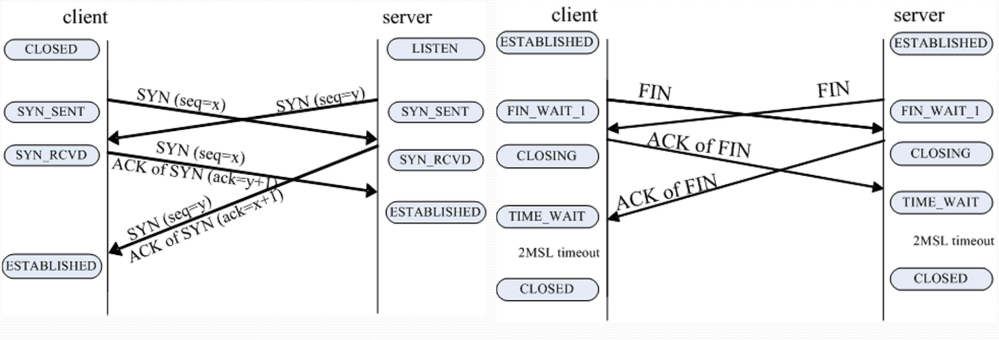

> Image credit to Professor Wang's slides

### Loss in establishment
#### Case 1: SYN sent by the client is lost
TCP uses **timeout** to get out.

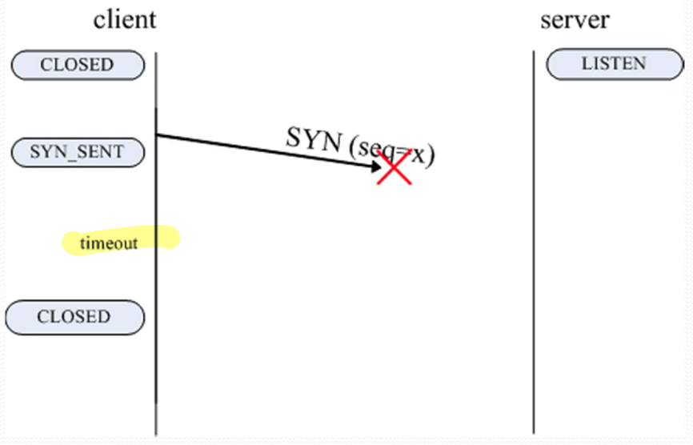

> Image credit to Professor Wang's slides


#### Case 2: SYN sent by the server is lost


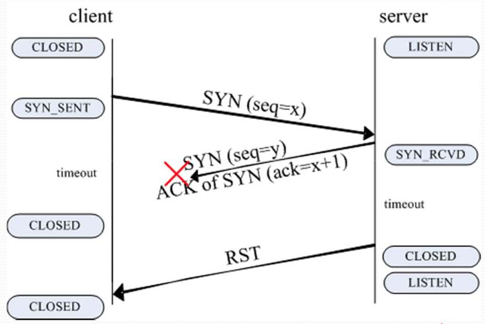

> Image credit to Professor Wang's slides

Why does the server send **RST** even if the client is closed, we shall see the answer in the next case.

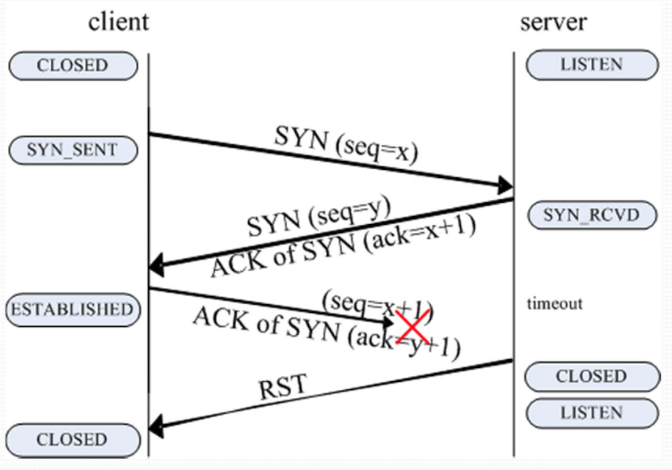

> Image credit to Professor Wang's slides

With the same state transition design, it can handle both case 2 & 3 regardless of whether the client is closed or established.

#### Case 3: ACK of SYN sent by the client is lost

### TCP state implementation
#### In `struct sock`
```c
volatile unsigned char state, //connection state
```
The `volatile` keyword prevent an optimizing compiler from optimizing away subsequent reads or writes and thus incorrectly reusing a state value or omitting writes. In other words, the CPU has to take the value from the memory every time the variable is used instead from the register. Because the register might not be synchronized with the memory.
#### State names
```c
static char *statename[] = {
    "Unused"    ,"Established"  ,"Syn Sent"     ,
    "Syn Recv"  ,"Fin Wait 1"   ,"Fin Wait 2"   ,
    "Time Wait" ,"Close"        ,"Close Wait"   ,
    "Last ACK"  ,"Listen"       ,"Closing"
};
```

## Reliability of data transfers

## Flow control and congestion control
## Header format and timer management


