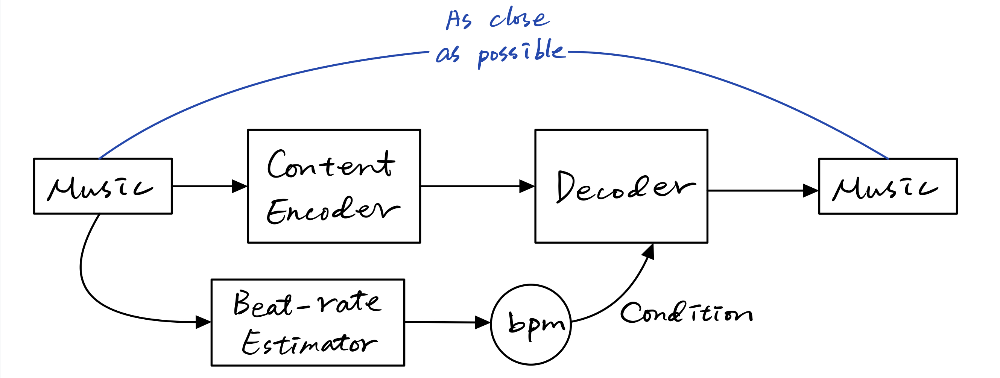

# Progress 2021-3-26

## Jupyter Notebook

- <a href="/JupyterAudioBasics.html" target="_blank">Jupyter Audio Basics</a>
- <a href="/TempoEstimation.html" target="_blank">Tempo Estimation</a>

## Architecture

In this unsupervised model, we want the **content encoder** to be independent of the beat rate information. After the traning completed, we can modified the bpm condition or apply two-stage training.
### Question
How to design a variable-length output layer?

#### Answer
Just make the output long enough, and truncate those aren't use, i.e., do not compute gradient for them.

## Implementation
```python
'''
Author: Ernie Chu
Project name: TSM-Net
Last Modify date: 2021/3/26
'''

import torch
import torch.nn as nn
import torch.functional as F
import math

class ConvBlock(nn.Module):
    '''
    1D CNN Block including configurations for
    - in_channel
    - out_channel
    - kernel_size
    - padding
    - stride
    - normalization layer
    - dropout rate
    '''
    def __init__(
        self,
        in_channels: int,
        out_channels: int,
        kernel_size: int = 4,
        padding: int = 0,
        stride: int = 1,
        norm_layer = nn.InstanceNorm1d,
        dropout: float = 0.
    ):
        super(ConvBlock, self).__init__()
        layers = [nn.Conv1d(
            in_channels, 
            out_channels, 
            kernel_size, 
            padding=padding, 
            stride=stride
        )]
        if norm_layer:
            layers.append(norm_layer(out_channels))
        layers.append(nn.Tanh())
        if dropout:
            layers.append(nn.Dropout(dropout))
        
        self.model = nn.Sequential(*layers)
        
    def forward(self, x):
        return self.model(x)
            
class ContentEncoder(nn.Module):
    '''
    Encoder for music content except tempo information using ConvBlock
    '''
    def __init__(
        self,
        in_channels=2,
        out_channels=1024,
        base_channels=32,
        block = ConvBlock
    ):
        super(ContentEncoder, self).__init__()
        layers = [block(in_channels, base_channels)]
        for channel_multiplier in range(0, int(math.sqrt(out_channels/base_channels))):
            layers.append(
                block(
                    base_channels*2**channel_multiplier,
                    base_channels*2**(channel_multiplier+1)
                )
            )
            
        self.model = nn.Sequential(*layers)

    def forward(self, x):
        return self.model(x)
    
if __name__ == "__main__":
    model = ContentEncoder()
    print(model)
```

### Output

```javascript
ContentEncoder(
  (model): Sequential(
    (0): ConvBlock(
      (model): Sequential(
        (0): Conv1d(2, 32, kernel_size=(4,), stride=(1,))
        (1): InstanceNorm1d(32, eps=1e-05, momentum=0.1, affine=False, track_running_stats=False)
        (2): Tanh()
      )
    )
    (1): ConvBlock(
      (model): Sequential(
        (0): Conv1d(32, 64, kernel_size=(4,), stride=(1,))
        (1): InstanceNorm1d(64, eps=1e-05, momentum=0.1, affine=False, track_running_stats=False)
        (2): Tanh()
      )
    )
    (2): ConvBlock(
      (model): Sequential(
        (0): Conv1d(64, 128, kernel_size=(4,), stride=(1,))
        (1): InstanceNorm1d(128, eps=1e-05, momentum=0.1, affine=False, track_running_stats=False)
        (2): Tanh()
      )
    )
    (3): ConvBlock(
      (model): Sequential(
        (0): Conv1d(128, 256, kernel_size=(4,), stride=(1,))
        (1): InstanceNorm1d(256, eps=1e-05, momentum=0.1, affine=False, track_running_stats=False)
        (2): Tanh()
      )
    )
    (4): ConvBlock(
      (model): Sequential(
        (0): Conv1d(256, 512, kernel_size=(4,), stride=(1,))
        (1): InstanceNorm1d(512, eps=1e-05, momentum=0.1, affine=False, track_running_stats=False)
        (2): Tanh()
      )
    )
    (5): ConvBlock(
      (model): Sequential(
        (0): Conv1d(512, 1024, kernel_size=(4,), stride=(1,))
        (1): InstanceNorm1d(1024, eps=1e-05, momentum=0.1, affine=False, track_running_stats=False)
        (2): Tanh()
      )
    )
  )
)
```
